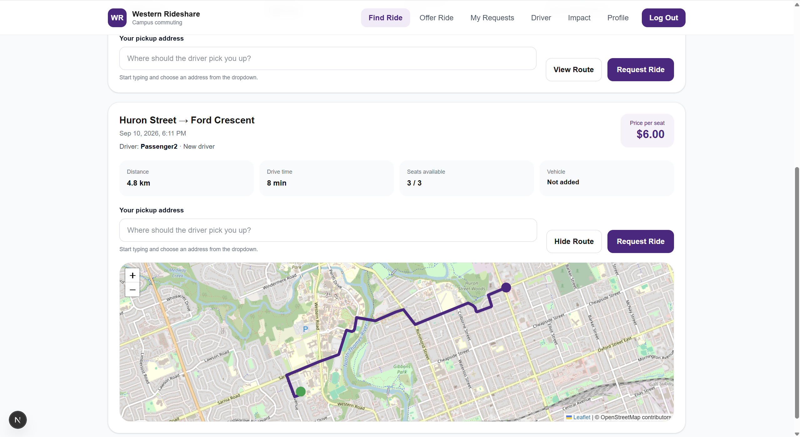
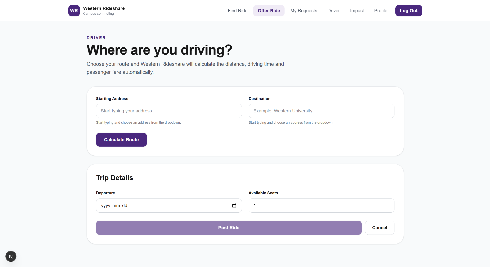
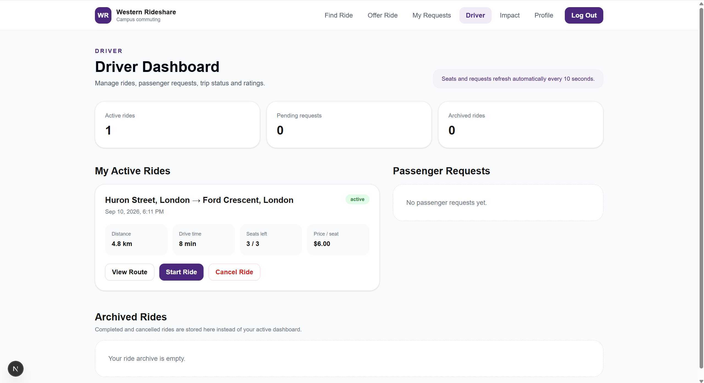

# Western Rideshare

A full-stack ridesharing platform designed for Western University students, allowing drivers to post rides and passengers to request seats through a centralized university-focused platform.

## Overview

Western Rideshare was built to make student transportation more affordable, organized, and accessible.

The platform supports complete driver and passenger workflows, including ride creation, ride requests, seat management, trip status updates, route calculations, vehicle information, and two-way ratings.

## Application Preview

### Find & Request Rides

Passengers can browse available rides, view route information, choose a pickup location, and request a seat.



### Offer a Ride

Drivers can enter their starting location and destination, calculate their route, choose departure details, and post a ride for passengers.



### Driver Dashboard

Drivers can manage active rides, passenger requests, seat availability, trip status, and archived rides from a centralized dashboard.



## Features

- JWT-based user authentication
- Driver and passenger workflows
- Ride creation and ride search
- Passenger ride requests
- Driver accept / decline functionality
- Seat availability tracking
- Trip lifecycle management
  - Active
  - In Progress
  - Completed
  - Cancelled
- Vehicle information
- Two-way driver and passenger ratings
- Ride history and archive
- Address autocomplete
- Interactive route visualization
- Passenger pickup routing
- Distance calculations
- Automated distance-based pricing
- Frontend polling for updated ride information
- Database locking for concurrent seat updates

## Tech Stack

### Frontend

- TypeScript
- React
- Next.js
- Tailwind CSS

### Backend

- Python
- FastAPI
- SQLAlchemy
- JWT Authentication

### Database

- PostgreSQL

### Mapping & Routing

- OpenStreetMap
- Photon
- OSRM

## How It Works

### Drivers

Drivers can:

1. Create a ride
2. Enter trip and vehicle information
3. View passenger requests
4. Accept or decline passengers
5. Start and complete trips
6. View completed and cancelled rides
7. Rate passengers after completed trips

### Passengers

Passengers can:

1. Search for available rides
2. Select a pickup location
3. Request a seat
4. View request status
5. Track ride information
6. View completed and cancelled rides
7. Rate drivers after completed trips

## Backend Architecture

The backend is built with FastAPI and SQLAlchemy using a PostgreSQL relational database.

RESTful APIs manage:

- Authentication
- Users
- Drivers
- Passengers
- Rides
- Ride requests
- Seat availability
- Vehicle information
- Trip status
- Ratings

JWT authentication is used to secure protected endpoints.

Row-level database locking is used during seat updates to reduce the risk of conflicting requests when multiple passengers interact with the same ride.

## Mapping & Routing

Western Rideshare integrates multiple OpenStreetMap-based services:

- **Photon** for address autocomplete
- **OSRM** for route generation and distance calculations
- **OpenStreetMap** for map visualization

These services are used to calculate trip distances, visualize routes, determine passenger pickup routing, and support automated pricing.

## Project Structure

```text
western-rideshare/
├── backend/
├── frontend/
├── screenshots/
├── README.md
└── .gitignore
```

The project is separated into frontend and backend components to keep the application modular and easier to maintain.

## Running Locally

### Backend

```bash
cd backend
```

Create and activate a virtual environment:

```bash
python -m venv venv
```

Install dependencies:

```bash
pip install -r requirements.txt
```

Start the backend from the `backend` directory:

```bash
uvicorn app.main:app --reload
```

### Frontend

Open a second terminal:

```bash
cd frontend
```

Install dependencies:

```bash
npm install
```

Start the development server:

```bash
npm run dev
```

Then open the local address provided by Next.js in your browser.

## What I Learned

Building Western Rideshare gave me hands-on experience with:

- Designing REST APIs
- Building relational database models
- Implementing authentication
- Managing frontend and backend state
- Handling concurrent database operations
- Integrating third-party services
- Designing multi-user application workflows
- Building a full-stack application from initial concept through implementation

## Future Improvements

- Real-time updates using WebSockets
- Automated testing
- Cloud deployment
- CI/CD
- Improved route optimization
- Additional mobile optimization
- Additional user verification features

## Author

**Angelo Casasanta**  
Software Engineering Student at Western University